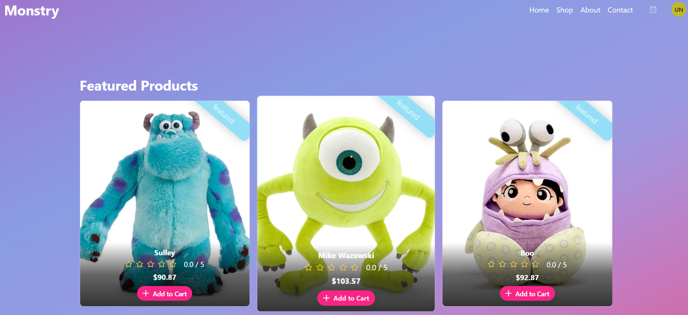
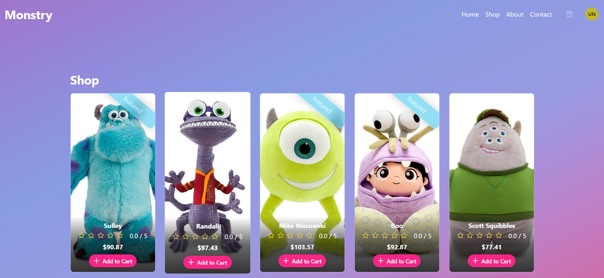
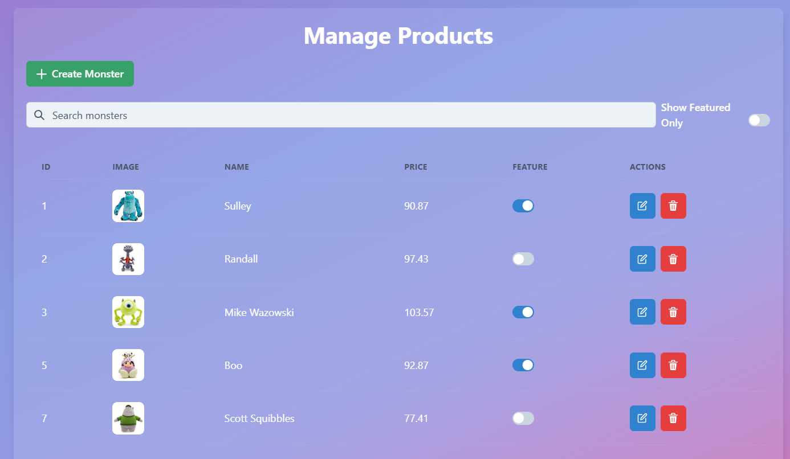

# 👾 Monster Shop - E-Commerce Platform

Monster Shop is an e-commerce application for buying adorable monster plushies, featuring product listings, reviews, and admin management.


## 🚀 Features
- **User-facing**:  
  ✅ Browse monster plushies with ratings  
  ✅ Read/write product reviews  

- **Admin panel**:  
  🔒 CRUD operations for products  
  📊 Manage user reviews  

## 🛠️ Technologies

- Java 21
- SpringBoot
- Git
- IntelliJ IDEA
- MySQL
- Postman
- Maven

## 🚀 Installation

1. Clone the repository:
```
git clone 
https://github.com/thaisrqueiroz/monstershop.git
```
2. Configure database:

Create a MySQL database named monstershop

Update application.properties:
```
spring.application.name=quotes

spring.datasource.url= ${DB_URL}
spring.datasource.username=${DB_USER}
spring.datasource.password=${DB_PASSWORD}

spring.jpa.hibernate.ddl-auto=create-drop
spring.jpa.properties.hibernate.dialect=org.hibernate.dialect.MySQLDialect
spring.datasource.driver-class-name=com.mysql.cj.jdbc.Driver
spring.jpa.show-sql=true
```
Update environment variables:
```
DB_URL=jdbc:mysql://localhost:3306/monstershop
DB_USER=your-user
DB_PASSWORD=your-password
```

3. Run the application:
```
./mvnw spring-boot:run
```

## 📍 API Endpoints

| Method	 | Endpoint	 | Description                |
|---------|-----------|----------------------------|
| GET     | /products | Get all products           |
| GET     | /products/{id} | Get a single product by ID |
| POST    | /products | Add a new product          |
| PUT     | /products/{id} | Update an existing product |
| DELETE  | /products/{id} | Delete a product           |
| GET     | /reviews/{id} | Get all reviews            |
| POST     | /reviews  | Add a new review           |

## 📂 Project Structure (Backend - Spring Boot)
```
com.example.monstershop/
├── config/
│ ├── CorsConfig.java
│ └── DBConfig.java
│
├── controllers/
│ ├── ProductController.java
│ └── ReviewController.java
│
├── dtos/
│ ├── product/
│ │ ├── ProductRequest.java
│ │ ├── ProductResponse.java
│ │ └── ProductMapper.java
│ │
│ └── review/
│ ├── ReviewRequest.java
│ ├── ReviewResponse.java
│ └── ReviewMapper.java
│
├── exceptions/
│ ├── DuplicateReviewException.java
│ ├── EmptyListException.java
│ ├── GlobalExceptionHandlern.java
│ ├── ProductAlreadyExistsException.java
│ └── ProductNotFoundException.java
│
├── models/
│ ├── Product.java
│ └── Review.java
│
├── repositories/
│ ├── ProductRepository.java
│ └── ReviewRepository.java
│
├── services/
│ ├── ProductService.java
│ └── ReviewService.java
│
└── MonstershopApplication.java
```

## 🖼️ View




